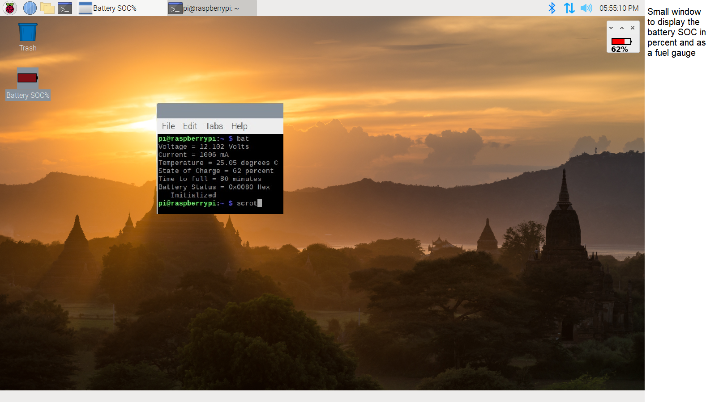

# This repo was forked from rricharz - Titled Raspberry Pi easy drawing with c and cairo

I used the information to create the battery fuel gauge shown on the right side of this picture.



See step 14 of my Instructable at the url below for more information.

https://www.instructables.com/Battery-Powered-Raspberry-Pi-in-Repurposed-Laptop/

The modifications I made were: 
 - Added my SMBus code to the application.c file. 
 - The application.h header file was changed to make a minimal size window (see screen grab above) with a fuel gauge and SOC percentage that is updated every 5 seconds. 
 - The main.c code and main.h header files are unmodified. 
 - The makefile has been modified to add a link to wiringPi. 
 - The battery symbol, "bat_icon.png" and the Battery_SOC.desktop file can be downloaded from this repo. 

The informatiion below is from the rricharz repo:

- Provides a simple framework for basic drawing with cairo and gtk+ 3.0
- All gtk+ functions are hidden away in main.c
- No knowledge about gtk+ is required
- You can concentrate on writing your own cairo drawing in application.c

**Important!** This version creates a fresh surface each time application_draw is called.
If you prefer the creation of a surface once at the beginning, and keep
drawing on the same surface, use
http://github.com/rricharz/Raspberry-Pi-easy-drawing-2 instead.

Just replace the simple example with your own code

- define your main window in application.h
- Code your cairo drawing in application.c
 
The framework provides functions

- to draw using cairo
- to initialize your code
- to exit your code
- a periodically called function (only executed if required)
- a function called if the mouse is clicked

Some nice examples of cairo snippets can be found at
  http://http://cairographics.org/samples/

To compile, you need to install gtk+ with the command

```
  sudo apt-get install libgtk-3-dev
```

Compile with

```
  make
```

Execute with

```
  ./application
```

Please open an issue on this repository if you have any problem with the program.
  
